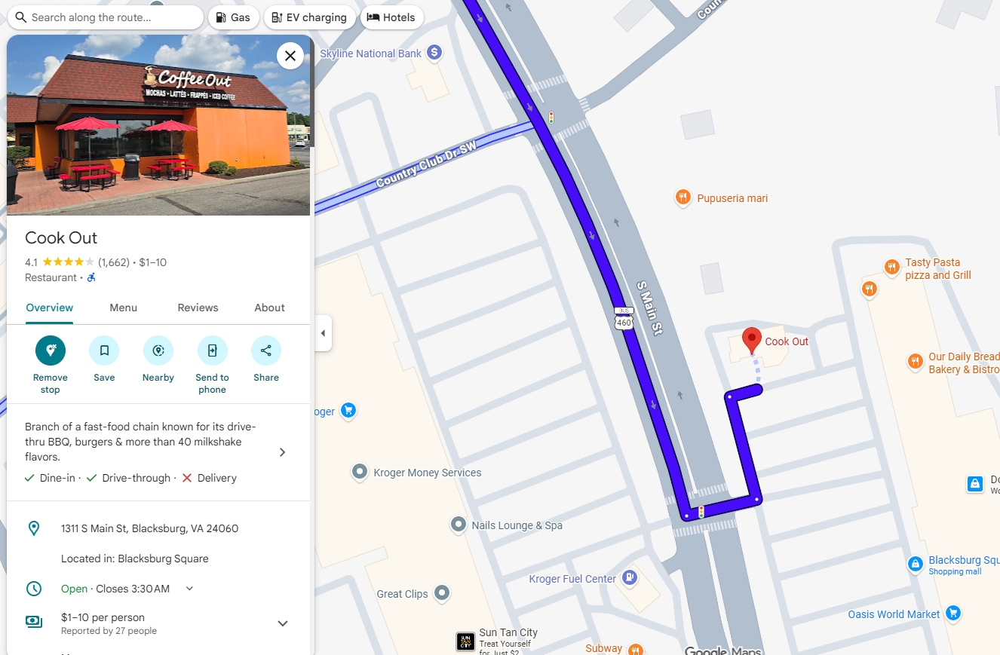

# Food in Blacksburg

From the outset, the options for food available to you in Blacksburg may seem insurmountably daunting in terms of quantity; however, if you know where to look, you’ll be able to find some great cuisine for a more than reasonable price. Likewise, there are a plethora of affordable grocery options available to you, you just need to know where to look, which is where this guide comes in. With it, we hope you’re able to discover your new favorite local places while still keeping your wallet relatively happy and healthy! Blacksburg has some great local spots, and you more than deserve to explore them.

## [Chinese Kitchen](https://www.chinesekitchenblacksburg.com/)

If you’re in the mood for ginormous portions of Chinese food, then Chinese Kitchen more than has you covered! For around $10, customers are supplied with two meals’ worth of food, an amount that more than justifies the price. Open until 10:00 pm on most days, Chinese Kitchen is a fantastic, and filling, late-night place that can satisfy all your after-hour cravings.

|  |  |
| :--- | :---- |
|Public Consenus| 3.6/5
|Price Range| $10–20
|Location| 1409 N Main St No. 002, Blacksburg, VA 24060
|Popularity| 7/10
|Overall Rating| 7.5/10
|  |  |

## [Cookout](https://thecookoutsmenu.us/)

A cheap, late-night fast food restaurant that primarily operates through a drive-through. Whereas most fast food places can charge the customer up to $20 for a meal, Cookout harkens back to a time when takeout was wholly affordable, averaging out at around $10 for a meal, two sides, and a drink. So whether you want a hamburger, a hot dog, or even a quesadilla, Cookout has you covered with a near endless variety of options to choose from.

!!! note

    While not necessary, I'd recommend taking a look at the menu online before heading through the drive-through. There are a lot of options available to you, and the menu is visually complicated at a first glance, so taking a look at it ahead of time will give you a smoother dining experience.

|  |  |
| :--- | :---- |
|Public Consenus| 4.1/5
|Price Range| $1–10
|Location| 1311 S Main Street, Blackburg, VA 24060
|Popularity| 8/10
|Overall Rating| 8/10
|  |  |

## [Aldi](https://www.aldi.us/)

If you’re looking for a cheap place to buy groceries in bulk, or just think Kroger and Food Lion are too expensive, Aldi is your one-stop-shop for inexpensive groceries. Unlike other grocery stores, 90% of items at Aldi are generic, non-branded products; however, these products make up for their lack of branding with a marginally cheaper price. So, if price matters more to you than branding, give Aldi a try. Your wallet will thank you.

|  |  |
| :--- | :---- |
|Public Consenus| 4.5/5
|Price Range| $5-45
|Location| 2265 N Franklin St, Christiansburg, VA 24073
|Popularity| 7/10
|Overall Rating| 7/10
|  |  |

## [Farmers Market](https://www.blacksburgfarmersmarket.com/)

The Blacksburg Farmer’s Market is a great local spot for fresh fruits, vegetables, and meat, amongst other items. From time to time, local musicians come and play live music, providing a relaxing ambience as you walk around and explore the area. Check it out if you’d like to get more in touch with the local culture of Blacksburg!

|  |  |
| :--- | :---- |
|Public Consenus| 4.8/5
|Price Range| $2-15
|Location| 108 W Roanoke St, Blacksburg, VA 24060
|Popularity| 9/10
|Overall Rating| 9/10
|  |  |

## [Blacksburg No. 1](https://www.blacksburgnumber1.com/)

Much like Chinese Kitchen, Blacksburg No. 1 offers their customers high-quality Chinese food at an affordable price. No matter what dining experience you’re in the market for, Blacksburg No. 1 fits into your preferences by providing both an option for take out and dining in. Averaging at around $15 per meal, this could be your next stop for authentic Chinese food.

|  |  |
| :--- | :---- |
|Public Consenus| 3.8/5
|Price Range| $10–20
|Location| 125 N Main St #400, Blacksburg, VA 24060
|Popularity| 7/10
|Overall Rating| 7.5/10
|  |  |

## [Joe's Diner](https://www.joesdinerva.com/)

To many Virginia Tech students, Joe’s Diner has some of the best breakfast food in town. Though, if you’re not in the mood for breakfast food, Joe’s Diner can also satisfy any lunch cravings you may have, offering things like burgers, sandwiches, and quesadillas. Open until 2:00pm on most days, this could end up being your new one-stop-shop for breakfast food.

|  |  |
| :--- | :---- |
|Public Consenus| 4.4/5
|Price Range| $10–20
|Location| N Main St, Blacksburg, VA 24060
|Popularity| 8/10
|Overall Rating| 8/10
|  |  |