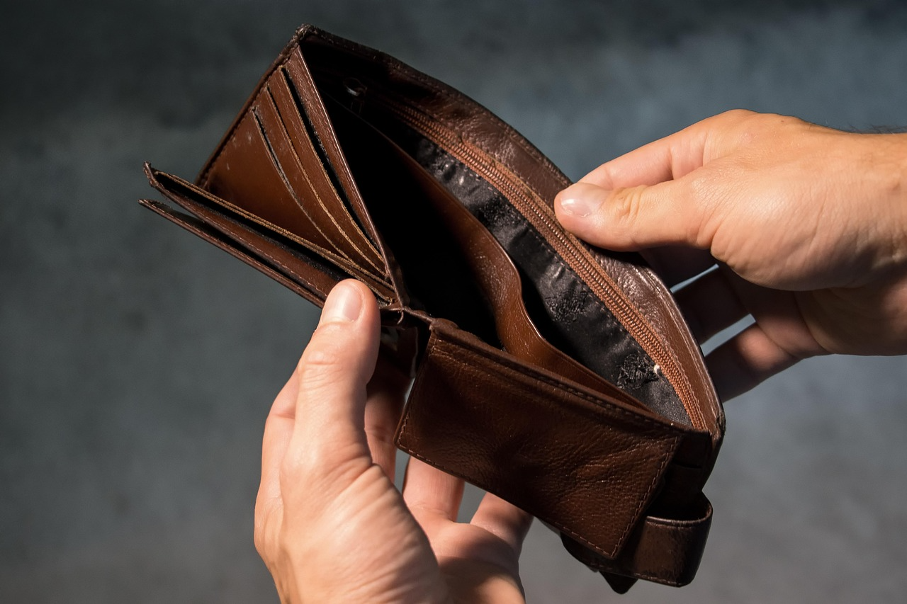

# Blacksburg on a Budget

Are you new to Blacksburg, wondering what the area has to offer, or just looking for a good meal, but are worried about getting the most bang for your buck? Then this User Guide has you covered! Including within it are sections dedicated to the various food, on-campus and off-campus entertainment, and shopping options located all around the area. Click the links below or on the side bar to learn more!

## [Food](food.md)

A section detailing the plethora of food options, like grocery stores and restaurants, available to you in Blacksburg. Options include places like Chinese Kitchen, Cookout, Aldi, Joe’s Diner, and more! If you’re hungry for more of what Blacksburg has to offer in terms of food, visit the attached page.

## [Blacksburg Entertainment](blacksburg_entertainment.md)

A section detailing the options for entertainment you can find all around the Blacksburg area. From movie theatres, to live music, to hiking trails, Blacksburg offers a wide variety of entertainment options anyone can enjoy. To find out more, visit the attached page.

## [On-Campus Entertainment](on_campus_entertainment.md)

A section detailing the types of entertainment you can find on-campus at Virginia Tech. Whether you want to visit the Breakzone at Squires Student Center, play tennis, or check out any on-campus events, Virginia Tech has you covered. If you’re a student, or just someone visiting the campus, make sure to visit the attached page!

## [Shopping](shopping.md)

A section detailing the various shopping options available to you in Blacksburg. If you’re in the market for clothes or accessories, places like Plato’s Closet and Uptown Cheapskate have you covered. To find out more about what Blacksburg has to offer in terms of shopping, visit the attached page.
