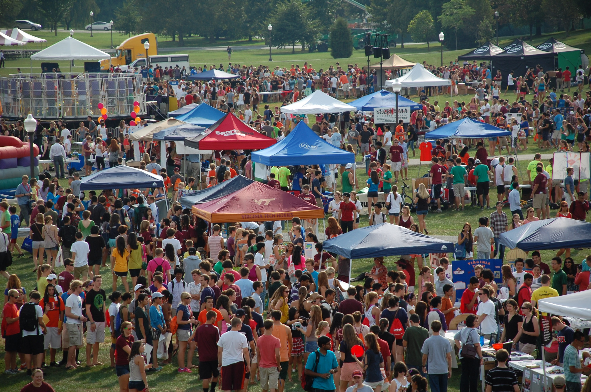
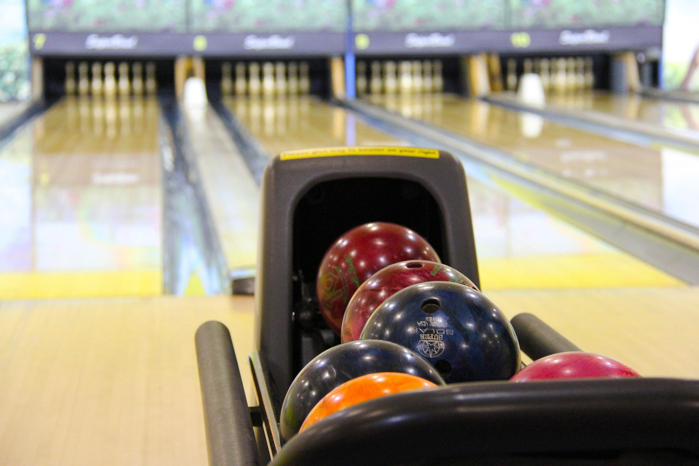
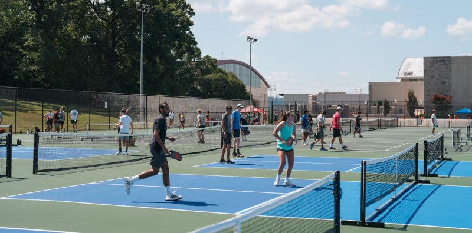

# On-Campus Entertainment

Virginia Tech’s campus offers a variety of amazing resources and organizations, including clubs, events, facilities, and more. As a community, Hokies are always finding new ways to support each other, get involved, and grow their social network. Here are some great ways that you can get involved on campus and start having fun on a budget.

## [GobblerFest](https://campuslife.vt.edu/student_centers/Squires.html)

Every Fall semester, GobblerFest is hosted on the Drillfield during the first week of classes. There are over 700 booths at the event, each representing a different organization, club, group, chapter, or program. Volunteers at each booth serve as informants to fellow Hokies, promoting their cause, giving student the opportunity to discover different avenues to get involved on and off campus.  Many booths even hand out prizes or merchandise. There are even rides and live performances so there’s something for everyone. If you’re lucky, maybe you’ll even see the HokieBird jaunting around.

## [Breakzone](https://campuslife.vt.edu/student_centers/Squires/BreakZone.html)
[Squires Student Center](https://campuslife.vt.edu/student_centers/Squires.html) contains a facility called Breakzone where students can go to hang out and spend time with friends in a relaxing environment. The area contains a bowling alley and billiards that adhere to the following schedules for pricing:

### Bowling
Monday–Friday before 2 p.m.: $0.75/game  
Monday–Friday after 2 p.m. and all day Saturday and Sunday: $3.50/game  
Shoe Rental: $2.50  
Sock Purchase: $2.50  

### Billiards
Rec Tables: $4/hr  
Club Tables: $5/hr  
Snooker Table: $5/hr  
Bumper Pool: $2.50/hr  

Breakzone hosts frequent events and tournaments for students to compete, connect, and even win cool prizes! 

## [Intramural Sports](https://recsports.vt.edu/intramuralsports.html)
Virginia Tech offers a wide variety of intramural sports across 2 Fall blocks and 2 Spring blocks along with summer activities. The best part is that participants only need to pay a flat fee of [$25 for membership](https://connect.recsports.vt.edu/Membership/Index) then they’re eligible to participate in any sport for the rest of the school year!

Intramural sports are a great way to stay active and have fun with other Hokies. Students can choose between competitive or recreational to determine the level of intensity and most sports have a Men’s, Women’s, and Co-Rec option. With diverse sports like Wallyball or Innertube Water Polo to classics like Soccer or Tennis, there truly is something for everyone.

## [Tennis and volleyball courts on campus](https://recsports.vt.edu/facilities/tenniscourts.html)
For Hokies who want to stay active for free, check out the tennis and volleyball courts on campus. The best part is how the community comes together on sunny days to enjoy these free facilities on campus. Grab your squad or meet new friends to enjoy these on-campus activities!

## [GobblerConnect](https://gobblerconnect.vt.edu/events)
GobblerConnect is the one-stop shop to discover on-campus events at Virginia Tech. A vast variety of options are displayed, including speakers, dining services, workshops, and many, many more. Some intriguing options for Spring 2026 include:

[Defying Gravity Movie Night](https://gobblerconnect.vt.edu/event/12318196) - Viewing party of Wicked. Snacks are provided.  
[Free Build Night](https://gobblerconnect.vt.edu/event/12135545) - Build LEGOs and hang out with friends.  
[Movement and Rhythm Workshop](https://gobblerconnect.vt.edu/event/12146855) - Celebrate movement and sound in this dance workshop.  
[Game Night](https://gobblerconnect.vt.edu/event/12304457) - Explore the gaming studio in Newman Library, play board and video games, enjoy free food, and connect with game-related organizations.  
[Brushes, Blooms, and Bubbles](https://gobblerconnect.vt.edu/event/11947202) - Paint flower pots while sipping mocktails. Any experience level welcome.  
[The Big Cookout](https://gobblerconnect.vt.edu/event/12313669) - Games, food, freebies, and craft from the food truck. Special appearance by the VT Therapy Dogs.  
[Mario Kart Tournament](https://gobblerconnect.vt.edu/event/12353166) - Play in a bracketed Nintendo Switch tournament and race for first place. Snacks are provided.  

GobblerConnect is arguably a Hokie’s most valuable resource to on-campus entertainment. Access hundreds of upcoming events at your fingertips and join in on the fun!